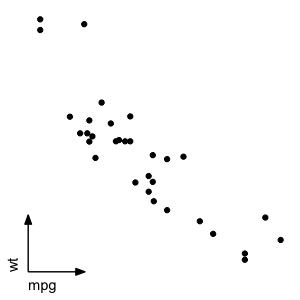

# ggfla - GGPlot2 Extension for Fixed-length Axis

This package is initially intended for making scanpy-style short-arrow axis in ggplot2. 
This package implements what is desired in the most appropriate way--exactly 
replacing the whole axis line with a fixed-length arrow. Other solutions for 
scanpy-style axis available at the moment of writing are all workarounds--hide 
the axis lines and draw arrowed-segment geoms within the plot panel.

This package provides a new theme element `element_line_fixlen`, which allows everything that
the ggplot2 original `element_line()` can specify, plus the `length` argument in `unit()`.
Besides, this packagee provides a short cut theme `theme_axis_shortArrow()` for scanpy-style axis.

## Usage

In short, it works as below:

```R
library(ggfla)
ggplot(mtcars, aes(mpg, wt)) +
    geom_point() +
    theme_axis_shortArrow()
```



Alternatively, the element can be customized within the `theme()` call:

```R
ggplot(mtcars, aes(mpg, wt)) +
    geom_point() +
    theme(
        axis.ticks = element_blank(),
        axis.text = element_blank(),
        panel.background = element_blank(),
        panel.grid = element_blank(),
        axis.title = element_text(hjust = 0),
        axis.line = element_line_fixlen(
          length = unit(15, "mm"),
          arrow = arrow(type = "closed", angle = 20, length = unit(0.1, "in"))
        )
    )
```

[For more guided usage, please see the package vignette.](https://github.com/mvfki/ggfla/blob/main/doc/ggfla.html)

## Installation

For now, this package can only be installed from source or from GitHub. To remotely
install from GitHub, run the following commands in a live R session:

```R
if (!requireNamespace("devtools", quietly = TRUE)) {
    install.packages("devtools")
}
devtools::install_github("mvfki/ggfla", build_vignettes = TRUE)
```

## Open development

This package is under open development. If you have any suggestions or find any bugs,
please feel free to open an issue or a pull request.
